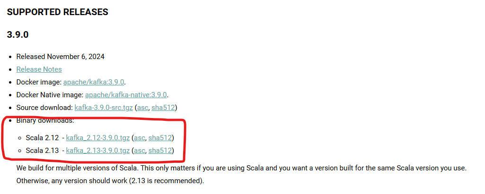

# Kafka-tutorial
a simple guide to hands on Kafka with Windows and docker

1. Using Docker
2. Using command line
3. Using windows WSL

# Using Docker

### Key Steps

1.Install Docker on Windows
2.Create the Docker-compose.yml for the starting the Kafka on you local docker
4.Hands on with Kafka topics
3.Step up a Spring boot Producer and a Consumer for a kafka topic

### Install Docker on Windows
If you have docker istalled on your PC then you are good to go. 
Otherwise You can go to the below website and download the corresponding docker archive which supports your windows and install it.
https://docs.docker.com/desktop/setup/install/windows-install/

### Create the Docker-compose.yml for the starting the Kafka on you local docker

Once you are completed with installing the Docker, you can create a docker-compose.yml to start the Zookeeper , Kafka and AKHQ.
you can find the corresponding docker compose file for all 3 in the docker folder of this project.
you can start the docker compose after changing the property "services.akhq.volumes" to match your PC's folder path in the docker-compose.yml

Once above is done you can run the below command to start the server (within the docker folder) 
docker-compose up -d

# Using Command Line

Go to the https://kafka.apache.org/downloads and download a binary from there

once downloaded 
1. extract the binary
2. go to the config folder
3. open the zookeeper.properties file
    * set the "dataDir" property for your config folder 
        ex :  dataDir=C:/kafka-docker/kafka_2.12/config
4. open the server.properties file
   * set the "log.dirs" property for your kafka-logs folder
        ex :  log.dirs=C:/kafka-docker/kafka_2.12/kafka-logs

once the above configs are done open two command-lines and execute the below command respectively 
1. to start the zookeeper server
    * ./bin/windows/zookeeper-server-start.bat config/zookeeper.properties
2. to start kafka server
    * ./bin/windows/kafka-server-start.bat config/server.properties
3. to check weather kafka started properly
   1. Creating topic
      * .\bin\windows\kafka-topics.bat --create --topic my-topic --bootstrap-server localhost:9092 
   2. Describing topic
      * .\bin\windows\kafka-topics.bat --describe --topic my-topic --bootstrap-server localhost:9092
   3. Write Command
      * .\bin\windows\kafka-console-producer.bat --topic my-topic --bootstrap-server localhost:9092
   4. Read Command
      * ./bin/windows/kafka-console-consumer.bat --topic my-topic --from-beginning --bootstrap-server localhost:9092